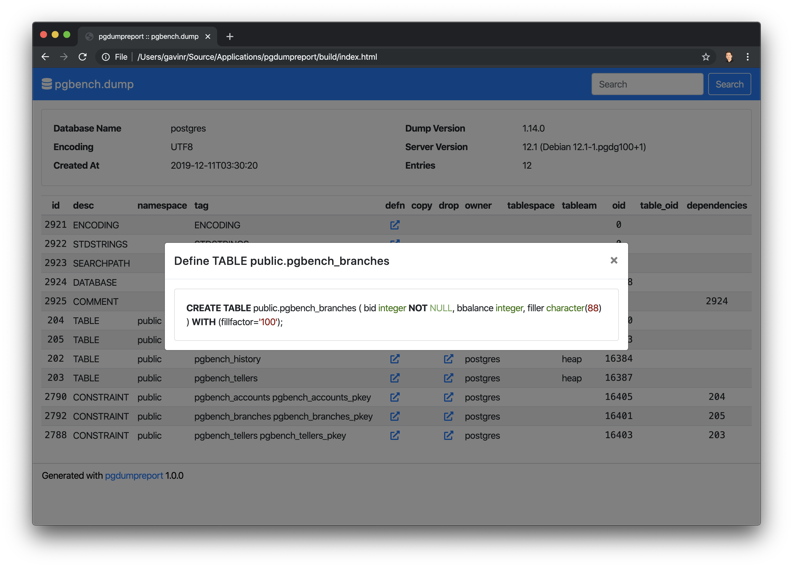

pgdumpreport
============
Generate a report from the contents of a pg_dump created archive.

|Version| |Status| |Coverage| |License|

Installation
------------

.. code-block:: bash

    pip3 install pgdumpreport

.. |Version| image:: https://img.shields.io/pypi/v/pgdumpreport.svg
   :target: https://pypi.python.org/pypi/pgdumpreport
   :alt: Package Version

.. |Status| image:: https://github.com/gmr/pgdumpreport/workflows/Testing/badge.svg
   :target: https://github.com/gmr/pgdumpreport/actions
   :alt: Build Status

.. |Coverage| image:: https://codecov.io/gh/gmr/pgdumpreport/branch/master/graph/badge.svg
   :target: https://codecov.io/github/gmr/pgdumpreport?branch=master
   :alt: Code Coverage

.. |License| image:: https://img.shields.io/pypi/l/pgdumpreport.svg
   :target: https://github.com/gmr/pgdumpreport/blob/master/LICENSE
   :alt: BSD
